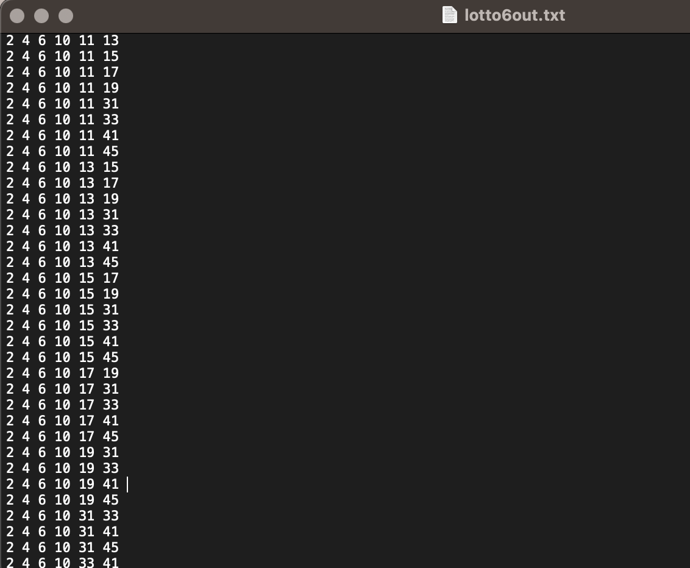
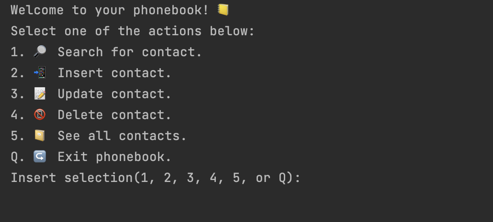
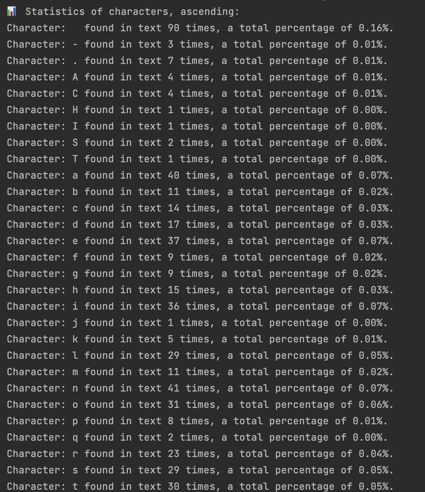
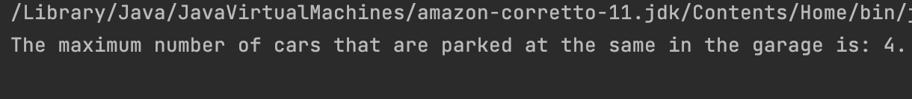
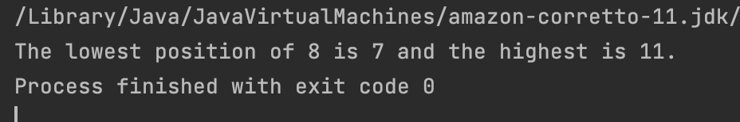
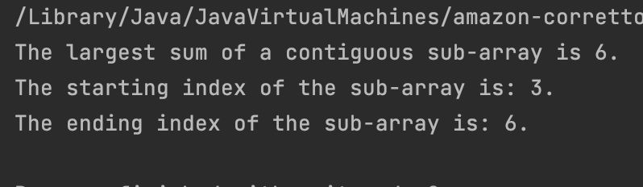
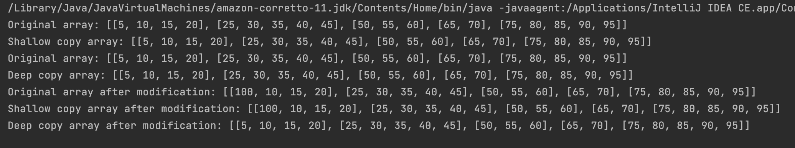
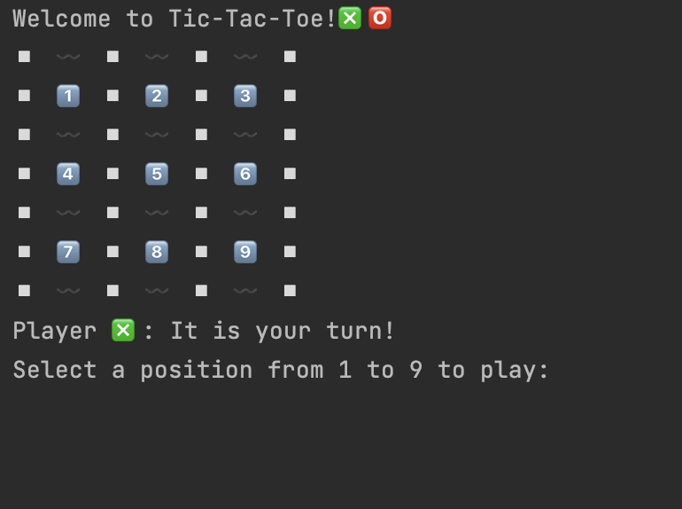
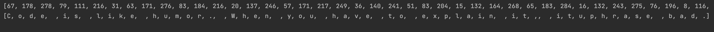
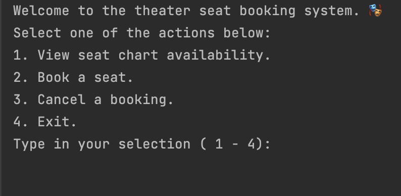

# Java Structured Programming
10 mini Java projects.  
*Coding Factory, AUEB, 2023.*

## Project 01 - Lotto 6 App
Reads integers from a file
until it finds *sentinel -1*.
The file must contain more than 6 integers, within the 1 - 49 range (inclusive).
The integers are inserted to an array and are sorted.
The program produces all possible combinations of 6 integers
that follow the following criteria:
1. the combination can have up to 4 even integers
2. the combination can have up to 4 odd integers
3. the combination can have up to 2 consecutive integers
4. the combination can have up to 3 integers with the same last digit
5. the combination can have up to 3 integers within the same decade (eg. 1 - 9, 11 - 19 etc.).
   The final list of combinations are printed in a .txt file.

### Output preview

## Project 02 - Phonebook App
Stores up to 500 contacts in an array.  
Contact information include: surname, name, phone number.  
Prints menu of options.
Actions that can be performed in phonebook:
1. search contact by phone number
2. insert contact
3. update contact
4. delete contact
5. see all contacts
6. exit phonebook.

### Output preview

## Project 03 - Char Statistics App
Reads one-by-one, all characters(any UTF-8 character) of a file and
inputs them in a 2D array, 256x2.  
Each row has two positions, one for the character
and one of its occurrence (count) within the text.  
main() prints out statistics for each character,
sorted by character and
by count.

### Output preview

## Project 04 - Max Car Arrivals App
Calculates the maximum number of cars parked at the same time in a hypothetical garage.  
The data is provided in a 2D array of the following format:  
arr[][] = { {1012, 1136}, {1317, 1417}, {1015, 1020} }  
where the first car arrived at 10:12 and departed at 11:36,
the second car arrived at 13:17 and departed at 14:17 etc.  
The app creates a helper 2D array, that marks each timestamp as 1 if it refers to an arrival
and 0 if it refers to departure.
By sorting the helper array in ascending order, it traverses it to count the concurrent cars.

Finally, it prints the max count.

### Output preview

## Project 05 - Get Low and High Index App
Finds and prints lowest and highest index of a key in a given sorted array,
after checking if the key exists in said array.  
For example, assume the given array is {0, 1, 4, 4, 4, 6, 7, 8, 8, 8, 8, 8}:
and the key is 8.  
The lowest index is in position 7 and the highest in position 11.

### Output preview

## Project 06 - Largest Sum of Contiguous SubArray App
Finds the largest sum of a contiguous sub-array within a given array.  
For example, if the given array is {-2, 1, -3, 4, -1, 2, 1, -5, 4},
the largest sum is 6, of the sub-array {4, -1, 2, 1}.  
The app uses **Kadane's algorithm**
and initially checks the following:  
a. if the array is empty  
b. if the array contains all non-negative numbers  
c. if the array contains all non-positive numbers.  
In the case of b., the problem is trivial, as a maximum sub-array is the entire array.  
In the case of c., the solution is any sub-array, of size one,
containing the maximal value of the array.  
The program prints the maximum sum if none of the above cases is true,
along with the starting and ending index of the sub-array.

### Output preview

## Project 07 - Array2D Shallow and Deep Copy App
Provides methods to create shallow and deep copies of a 2D array.   
It demonstrates how both methods work and prints their string representations.

### Output preview

## Project 08 - TicTacToeApp
Implements a Tic Tac Toe game application.  
It reads the position selection from two players (X and o)
and updates the board game adding the players symbol.  
The game continues until either a player has made a winning combination
or the number of rounds has been completed, where the game is a draw.

### Output preview

## Project 09 - Cryptography App
Provides methods for
encrypting and decrypting a phrase
based on a given key.  
It uses a simple encryption algorithm based on modular
arithmetic.

### Output preview

## Project 10 - Theater Seats App
Represents a theater seat booking system. 
It allows users to view the seat availability,
book seats, and cancel bookings.

### Output preview

